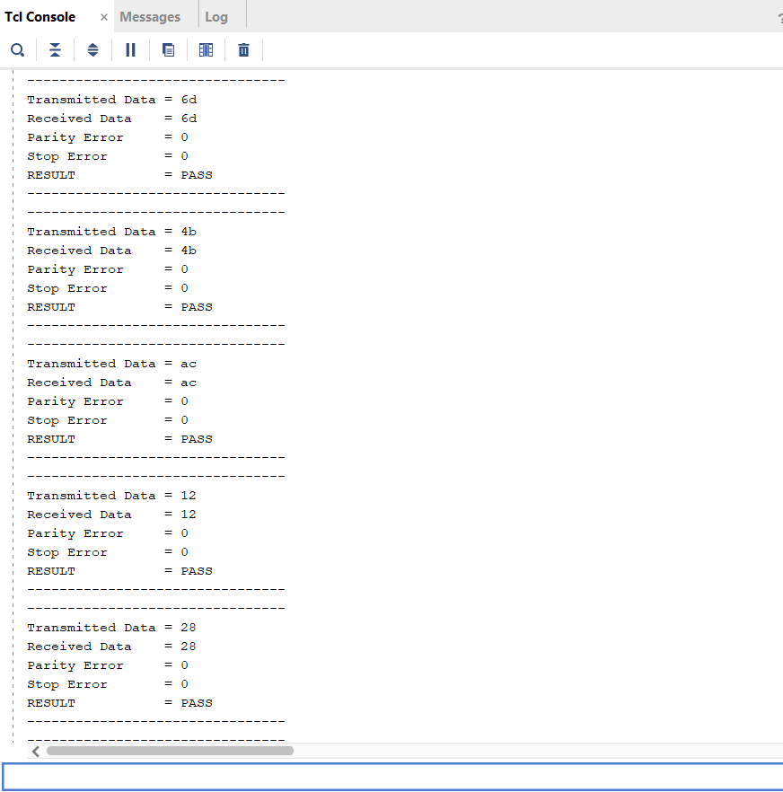
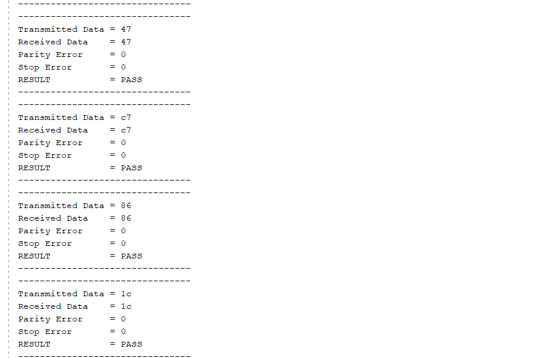

# UART Communication System Design and SystemVerilog Verification Environment

A complete UART (Universal Asynchronous Receiver-Transmitter) communication system designed in Verilog HDL, verified using a custom-built SystemVerilog verification environment inspired by UVM (Universal Verification Methodology) architecture.

---

## Project Overview

This project covers both the **RTL design** of a UART communication system and the **functional verification** of that design using a layered testbench environment. The UART uses **16x oversampling** for robust baud rate detection.

**Skills Demonstrated:**
- SystemVerilog
- Functional Verification
- Transaction-Level Modeling (TLM)
- Constrained Random Verification
- Scoreboard-Based Self-Checking
- UVM-inspired Verification Architecture
- Verilog HDL / RTL Design
- UART Protocol

---

## Project Architecture

### RTL Design

```
uart_tx.v        — UART Transmitter
uart_rx.v        — UART Receiver (16x oversampling)
baud_generator.v — Baud Rate Generator
```

### Verification Environment

```
tb_top
│
├── uart_if              (Interface)
├── uart_tx              (DUT - Transmitter)
├── uart_rx              (DUT - Receiver)
├── baud_generator       (DUT - Baud Clock)
│
└── uart_environment
     │
     ├── uart_sequence    (Generates random transactions)
     ├── uart_scoreboard  (Self-checking PASS/FAIL)
     │
     └── uart_agent
          │
          ├── uart_sequencer
          ├── uart_driver
          └── uart_rx_monitor
```

### Data Flow

```
Sequence → Sequencer → Driver → UART TX DUT → UART RX DUT → Monitor → Scoreboard
```

---

## Verification Components

| Component | Role |
|---|---|
| `uart_transaction` | Represents one UART packet (maps to `uvm_sequence_item`) |
| `uart_sequence` | Generates 100 random transactions |
| `uart_sequencer` | Arbitrates between sequences and driver |
| `uart_driver` | Drives DUT signals from transactions |
| `uart_rx_monitor` | Passively observes RX output |
| `uart_scoreboard` | Compares expected vs received data (PASS/FAIL) |
| `uart_agent` | Contains sequencer, driver, and monitor |
| `uart_environment` | Top-level env with agent and scoreboard |

---

## Test Cases

- **Normal Transmission** — End-to-end TX→RX verification with random data
- **Multiple Random Transactions** — 100 constrained-random packets verified automatically
- **Parity Error Injection** — Verifies correct parity error detection
- **Stop Bit Error Injection** — Verifies stop-bit error handling
- **Loopback Verification** — TX output directly connected to RX input

---

## File Structure

```
UART_UVM_PROJECT/
│
├── rtl/
│   ├── uart_tx.v
│   ├── uart_rx.v
│   └── baud_generator.v
│
├── interface/
│   └── uart_if.sv
│
├── sequence_item/
│   └── uart_transaction.sv
│
├── sequence/
│   └── uart_sequence.sv
│
├── sequencer/
│   └── uart_sequencer.sv
│
├── driver/
│   └── uart_driver.sv
│
├── monitor/
│   └── uart_rx_monitor.sv
│
├── scoreboard/
│   └── uart_scoreboard.sv
│
├── agent/
│   └── uart_agent.sv
│
├── env/
│   └── uart_environment.sv
│
└── tb/
    └── top.sv
```

---

## Key Features

- **Complete UVM-inspired Architecture** — Built from scratch without using UVM libraries, demonstrating deep understanding of verification principles
- **Self-Checking Testbench** — Automated scoreboard compares expected vs actual data with no manual intervention
- **Constrained Random Verification** — Generates diverse test scenarios automatically (100+ transactions per simulation)
- **Error Injection Testing** — Validates error detection for parity and stop-bit violations
- **Transaction-Level Modeling** — Abstracts protocol details into reusable transaction objects
- **Layered Agent/Environment Hierarchy** — Modular design enables easy reuse and extension

---

## Tools & Technologies

- Verilog / SystemVerilog
- ModelSim / QuestaSim (or equivalent)
- GTKWave (waveform analysis)

---

## Verification Results

Simulation results showing successful UART verification with 
constrained random testing:





**Test Results:**
- ✅ 100+ random transactions verified
- ✅ All transmitted data matches received data
- ✅ Parity error detection working
- ✅ Stop bit error detection working
- ✅ RESULT: PASS
